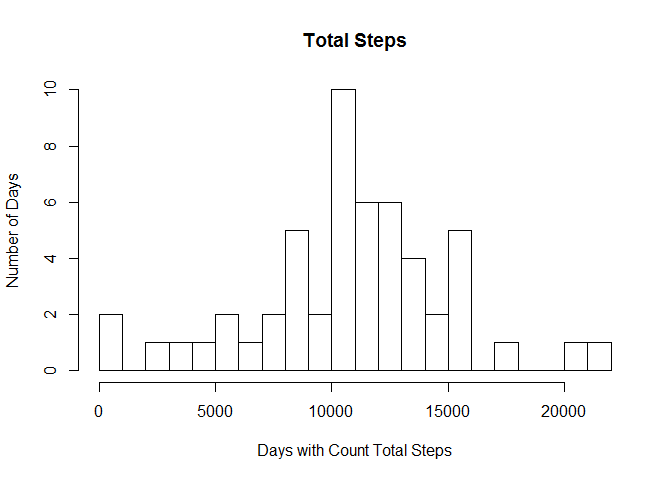
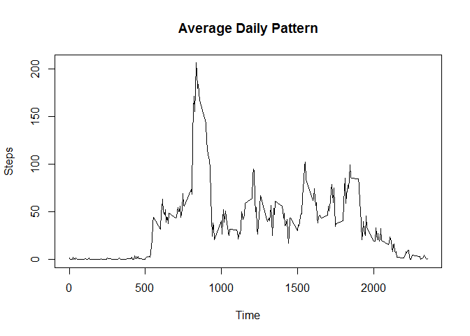
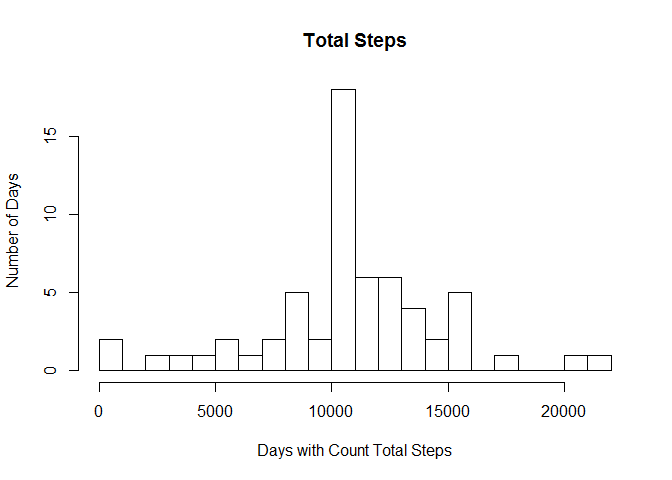
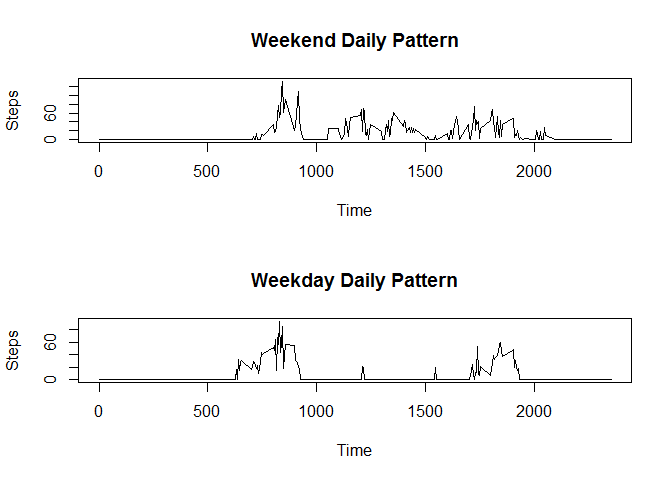

# Reproducable Reasearch Coursework 1
William Moore  
February 5, 2016  

# Read the data
The data set of qualified self movement was initially downloaded from [here](https://d396qusza40orc.cloudfront.net/repdata%2Fdata%2Factivity.zip) on 2016-02-05.  
First I read the data


```r
rawData <- read.csv("Data/raw_data.csv")
```

# Total Number of Steps Each Day
The histogram below shows a histogram of the total number of steps taken each day


```r
stepsOnDay <- subset(rawData, !is.na(rawData$steps), select=c("date", "steps"))
stepsOnDay$date <- as.Date(stepsOnDay$date)

totalStepsOnDay <- aggregate(stepsOnDay[c("steps")], by=list(stepsOnDay$date), FUN=sum, 1)

hist(totalStepsOnDay$steps, main = "Total Steps", xlab = "Days with Count Total Steps", ylab = "Number of Days", breaks = 20)
```



```r
meanStepsOnDay <- mean(totalStepsOnDay$steps)
medianStepsOnDay <- median(totalStepsOnDay$steps)
```

Mean steps = 1.0767189\times 10^{4}  
Median steps = 1.0766\times 10^{4} 


# Average Daily Pattern

```r
stepsInteavl <- subset(rawData, select=c("interval", "steps"))

averageStepsInteval <- aggregate(stepsInteavl[c("steps")], by=list(stepsInteavl$interval), FUN=mean, na.rm = TRUE)

plot(averageStepsInteval$Group.1, averageStepsInteval$steps, type="l", main = "Average Daily Pattern", xlab = "Time", ylab = "Steps")
```



```r
maxInteval <- which.max(averageStepsInteval$steps)
maxIntevalTime <- averageStepsInteval$Group.1[maxInteval]
maxIntevalValue <- averageStepsInteval$steps[maxInteval]
```

The inteval with the most steps was 835. There were average steps of 206.1698113.  

# Missing Values
Here we simulate the missing values in the original data set using the average value from that time inteval on all other days.  


```r
totalMissingValues <- length(rawData$steps) - length(stepsInteavl$steps)

dataWithSimulatedValues <- rawData

for (i in 1:length(dataWithSimulatedValues$steps))
{
    if(is.na(dataWithSimulatedValues$steps[i])){
        index <- Position(function(y){y == dataWithSimulatedValues$interval[i]}, averageStepsInteval$Group.1)
        dataWithSimulatedValues$steps[i] <- averageStepsInteval$steps[index]
    }
}
```

The total missing values from the original data set was 0  
We now plot with the simulated values


```r
stepsOnDay <- subset(dataWithSimulatedValues, select=c("date", "steps"))
stepsOnDay$date <- as.Date(stepsOnDay$date)

totalStepsOnDay <- aggregate(stepsOnDay[c("steps")], by=list(stepsOnDay$date), FUN=sum, 1)

hist(totalStepsOnDay$steps, main = "Total Steps", xlab = "Days with Count Total Steps", ylab = "Number of Days", breaks = 20)
```



```r
meanStepsOnDay <- mean(totalStepsOnDay$steps)
medianStepsOnDay <- median(totalStepsOnDay$steps)
```

Mean steps = 1.0767189\times 10^{4}  
Median steps = 1.0767189\times 10^{4} 

# Differance Between Weekdays and Weekends

```r
dataWithSimulatedValues$IsWeekend <- weekdays.Date(as.Date(dataWithSimulatedValues$date)) == "Saturday" | weekdays.Date(as.Date(dataWithSimulatedValues$date)) == "Sunday"

weekendData <- subset(dataWithSimulatedValues, dataWithSimulatedValues$IsWeekend, select=c("interval", "steps"))
weekdayData <- subset(dataWithSimulatedValues, !dataWithSimulatedValues$IsWeekend, select=c("interval", "steps"))

averageStepsIntevalWeekend <- aggregate(weekendData[c("steps")], by=list(weekendData$interval), FUN=mean, 1, na.rm = TRUE)
averageStepsIntevalWeekday <- aggregate(weekdayData[c("steps")], by=list(weekdayData$interval), FUN=mean, 1, na.rm = TRUE)

par(mfrow=c(2,1))
plot(averageStepsIntevalWeekend$Group.1, averageStepsIntevalWeekend$steps, type="l", main = "Weekend Daily Pattern", xlab = "Time", ylab = "Steps")
plot(averageStepsIntevalWeekday$Group.1, averageStepsIntevalWeekday$steps, type="l", main = "Weekday Daily Pattern", xlab = "Time", ylab = "Steps")
```


